# Custom Shaders

My collections of custom shader for terrain, UI and others

## Dynamic Sprite Color (Sprite Unlit)
### Using a mask in original sprite sheet
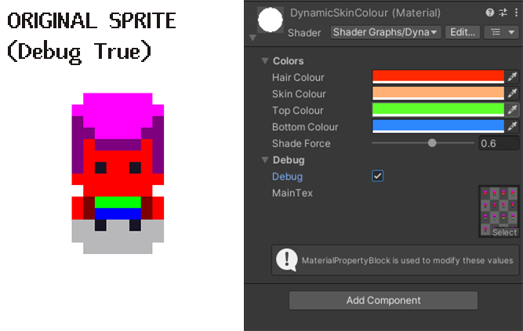

### Applying a color pallet 
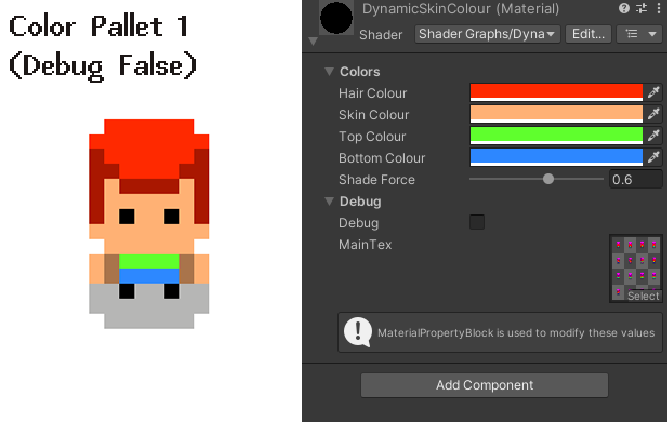
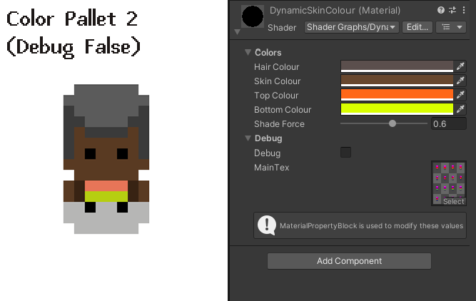

## Lowpoly Terrain

## Auto Terrain Texture V1

## PBR Mixamo Shader

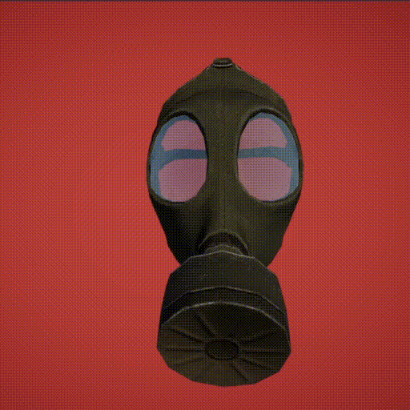

## PSX Unlit Shader
*PSX Unlit / URP UNLIT*

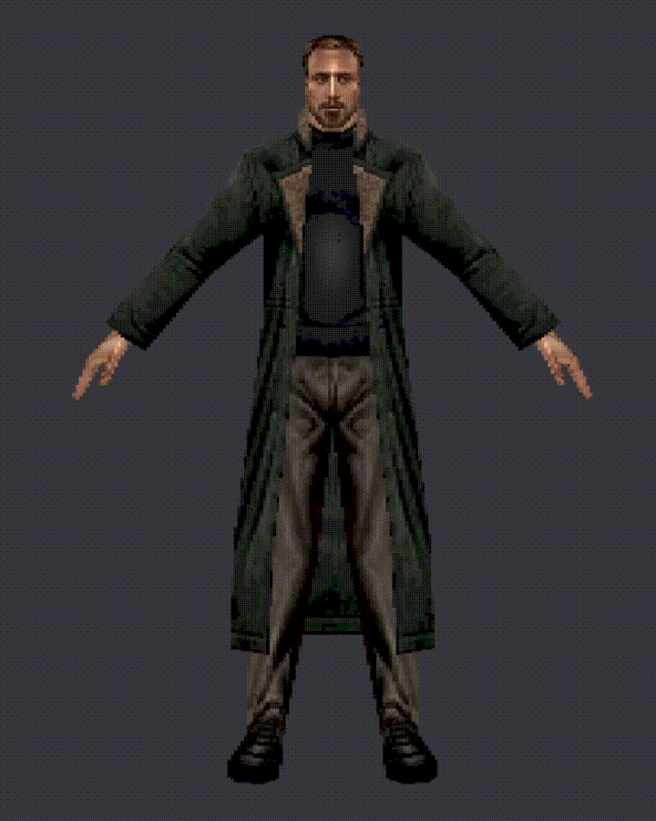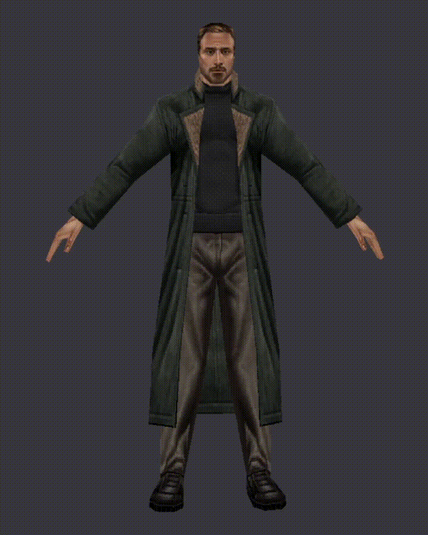

## HDRP Water Shader

## URP Water Shader
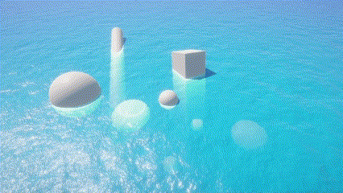
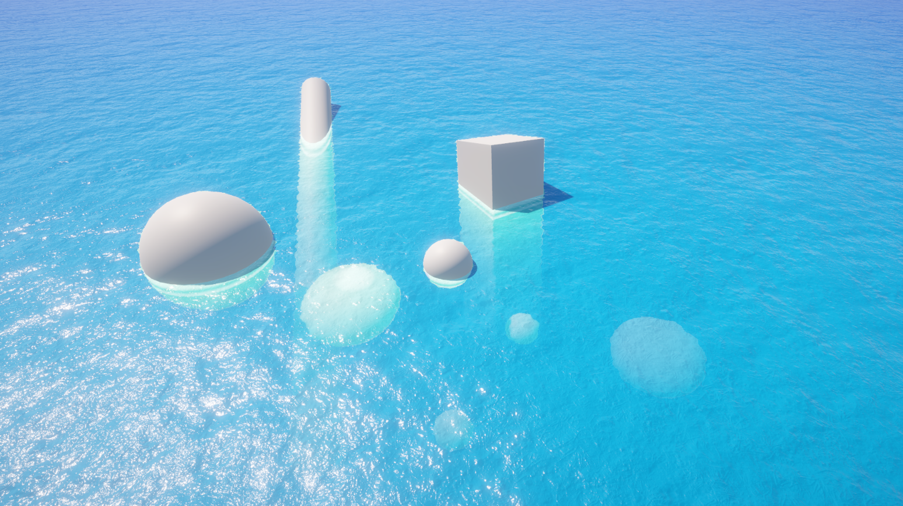
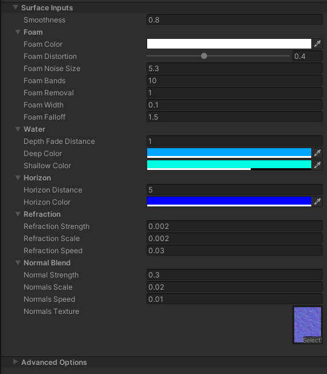

## Auto Terrain Shader V3 HDRP
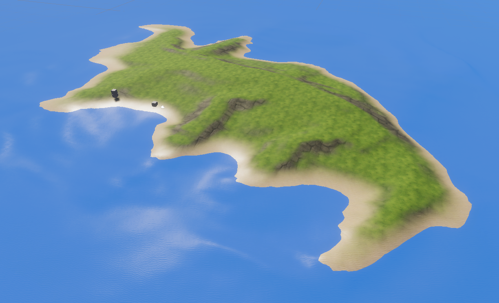
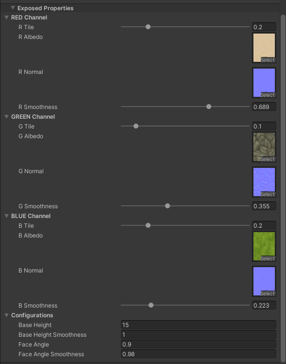

## Auto Terrain Shader V3 URP

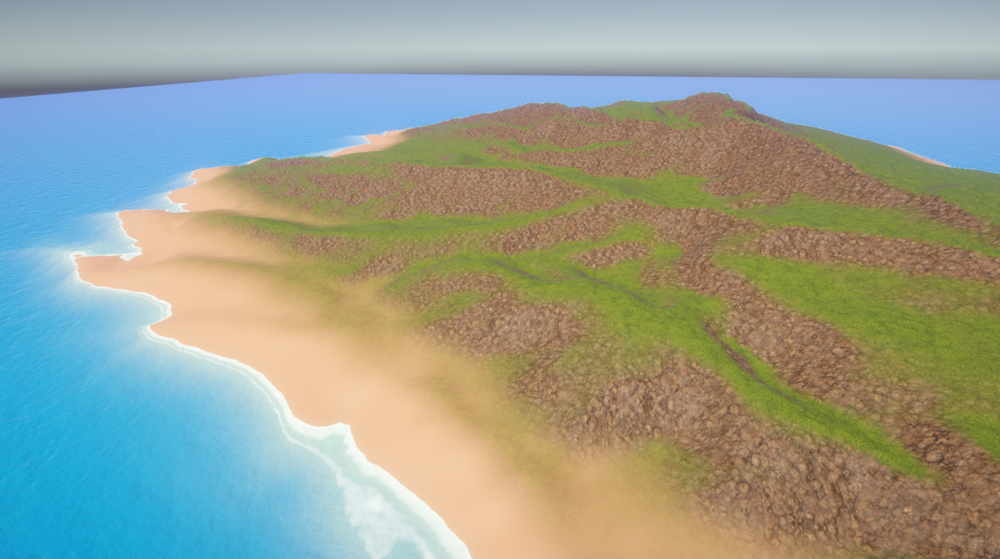
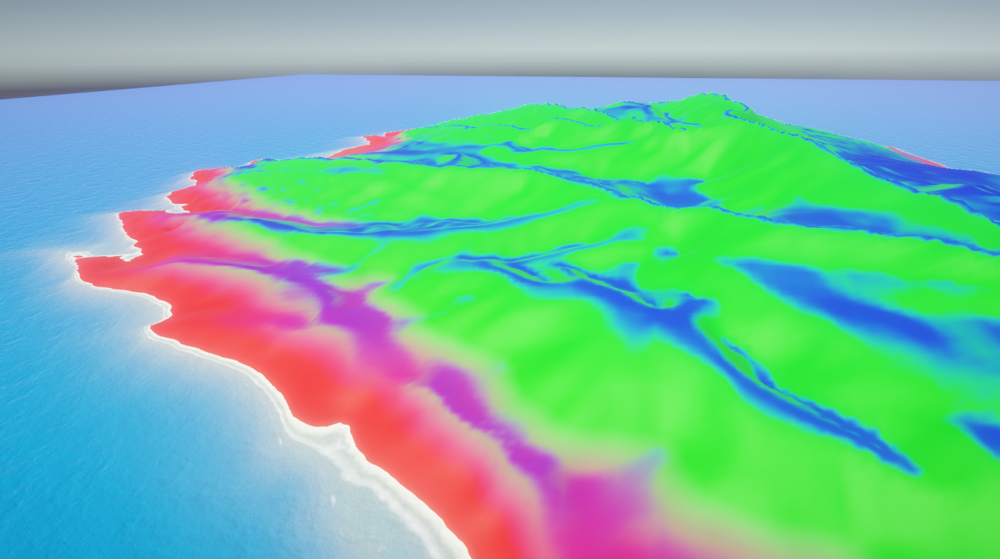

