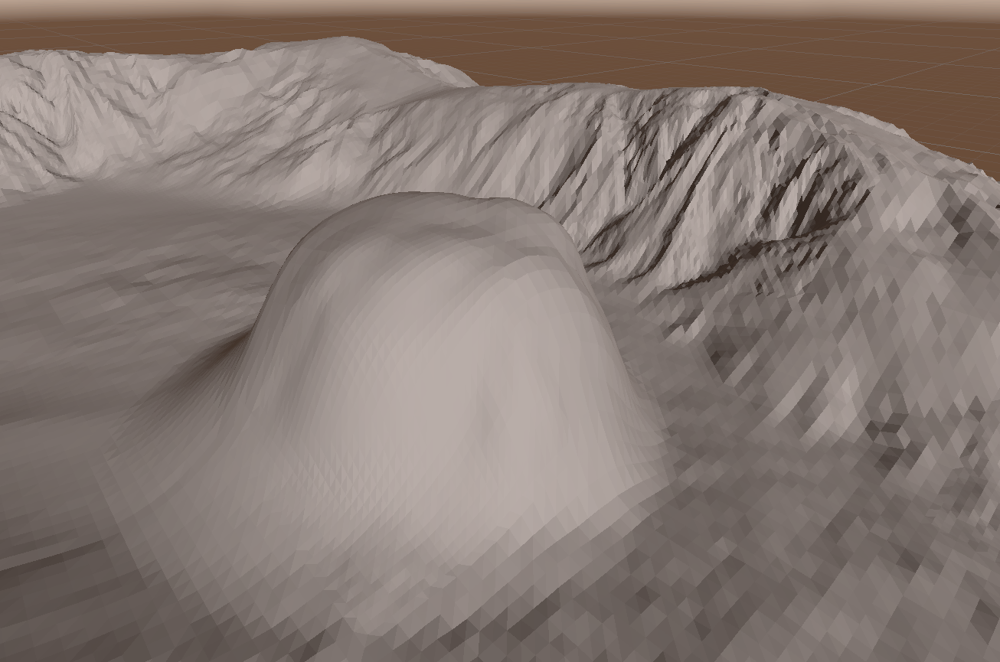

# Custom Shaders

My collections of custom shader for terrain, UI and others

 

## Lowpoly Terrain Shader

Perfect for stylized effect on terrain

## Auto Terrain Shader

Custom terrain shader for auto applying texture with infinity repeating pattern technique

## PSX Unlit Shader

Custom shader that imitates PSX shader without Vertex precision

### PSX Unlit / URP UNLIT
 

## Simple Water Shader

Simple water shader with refraction, depth color and foam

 

# more...
