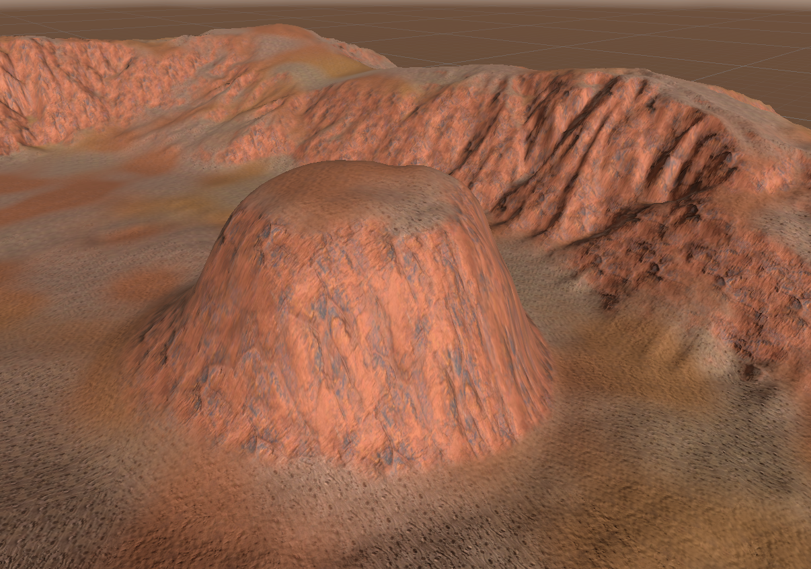

# Custom Shaders

My collections of custom shader for terrain, UI and others

 

## Lowpoly Terrain

## Auto Terrain Texture V1

## PSX Unlit Shader
### PSX Unlit / URP UNLIT
 

## Simple Water Shader
 

## Auto Terrain Shader V3 (3 texture based on height and face angle)

